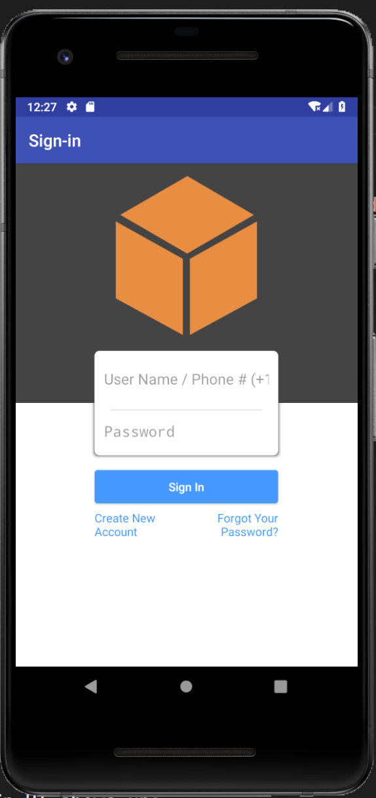
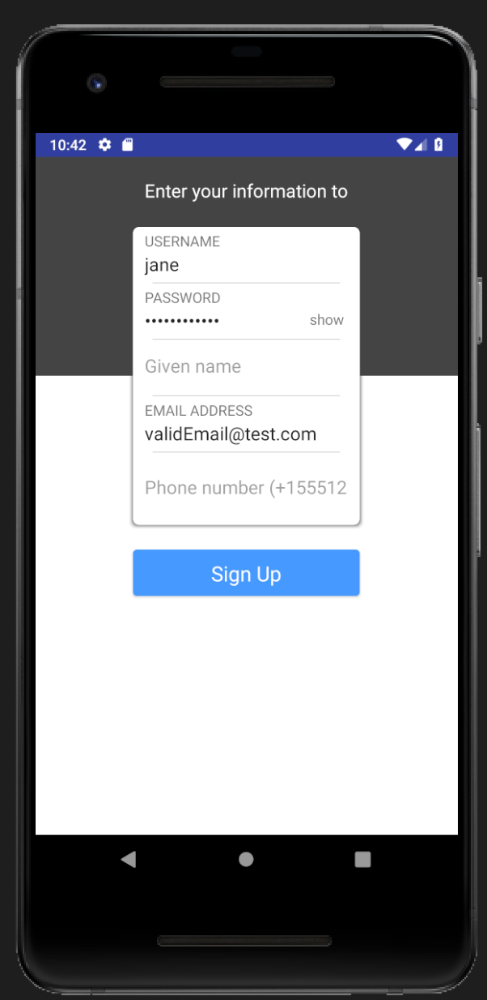
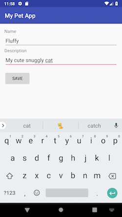
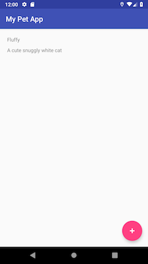
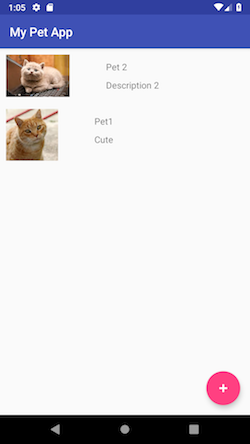

# Building Android Mobile Applications with AWS Amplify

In this workshop we'll learn how to build cloud-enabled Android mobile applications with [AWS Amplify](https://aws-amplify.github.io/).


### Topics we'll be covering:

- [Add API, Authentication and Generate Client Code with AWS Amplify](https://github.com/janeshenamazon/amplify-android#adding-a-graphql-api-authentication-and-generate-client-code)
- [Build the Android App](https://github.com/janeshenamazon/amplify-android#build-the-android-application)
- [Query Data](https://github.com/janeshenamazon/amplify-android#query-for-data)
- [Modify Data](https://github.com/janeshenamazon/amplify-android#modify-data-add-a-pet)
- [Subscribe to Data Changes](https://github.com/janeshenamazon/amplify-android#subscriptions)
- [Working with Storage](https://github.com/janeshenamazon/amplify-android#working-with-storage)


## Redeeming our AWS Credit   

1. Visit the [AWS Console](https://console.aws.amazon.com/console).
2. In the top right corner, click on __My Account__.
3. In the left menu, click __Credits__.

## Getting Started - Setting up a New Android Project

### Create a new Android Project

To get started, we first need to create a new Android project.

If you already have Android Studio installed and configured, go ahead and create a new Android project.

Select **Phone and Tablet**, and choose **Android SDK level 26**, click **Next**.

In the **Add an Activity to Mobile** screen, select **Basic Activity**. Click **Next**, keep the default values, and click **Finish** to finish project setup.

### Import AWS AppSync SDK and Config

To use AWS AppSync in our new Android project, modify the **project**'s `build.gradle` file and add the following dependency in the build script:

```Java
classpath 'com.amazonaws:aws-android-sdk-appsync-gradle-plugin:2.6.+'
```

Next, in the **app**'s `build.gradle` add in a plugin of `apply plugin: 'com.amazonaws.appsync'` and dependencies for AWS AppSync and MqttServices. 

As a result, your `build.gradle` should look like:

```Java
apply plugin: 'com.android.application'
apply plugin: 'com.amazonaws.appsync'
android {
    // ... typical items
}
dependencies {
    // ... typical dependencies

    implementation 'com.amazonaws:aws-android-sdk-appsync:2.6.+'
    implementation 'org.eclipse.paho:org.eclipse.paho.client.mqttv3:1.2.0'
    implementation 'org.eclipse.paho:org.eclipse.paho.android.service:1.1.1'
}
```

Finally, update your `AndroidManifest.xml` with updates to `<uses-permissions>` for network calls and offline state. Also, add a `<service>` entry under `<application>` for MqttService so we can use subscriptions:

```xml
<uses-permission android:name="android.permission.INTERNET"/>
<uses-permission android:name="android.permission.ACCESS_NETWORK_STATE"/>
<uses-permission android:name="android.permission.WAKE_LOCK" />
<uses-permission android:name="android.permission.READ_PHONE_STATE" />
<uses-permission android:name="android.permission.WRITE_EXTERNAL_STORAGE"/>
<uses-permission android:name="android.permission.READ_EXTERNAL_STORAGE"/>

        <!--other code-->

    <application
        android:allowBackup="true"
        android:icon="@mipmap/ic_launcher"
        android:label="@string/app_name"
        android:roundIcon="@mipmap/ic_launcher_round"
        android:supportsRtl="true"
        android:theme="@style/AppTheme">

        <service android:name="org.eclipse.paho.android.service.MqttService" />

        <!--other code-->
    </application>
```

**Build your project** ensuring there are no issues.

## Installing the AWS Amplify CLI amd Initializing a new AWS Amplify Project

### Installing the AWS Amplify CLI

To fully leverage the AWS Amplify CLI toolchain, let's install the AWS Amplify CLI. Open your Terminal, and run the following in command line:

```bash
npm install -g @aws-amplify/cli -update
```

### Initializing the AWS Amplify Project

Next, let's initialize a new AWS Amplify project for your Android app.

`cd` into your Android Studio project root in a Terminal window, and run the following:

```bash
amplify init
```

- Choose your default editor: __Visual Studio Code (or your favorite editor)__   
- Please choose the type of app that you're building: __android__   
- Where is your Res directory:  (app/src/main/res): __Press Enter to accept the default__    
- Do you want to use an AWS profile? __Y__
- Please choose the profile you want to use: __default__

CloudFormation will now run for your AWS account to configure the initial infrastructure to support your app. After it's completed, the AWS Amplify CLI toolchain will have initialized a new project and you will see a couple of new files and folders in your app's project directory: __amplify__ and __.amplifyrc__. These files hold your project's configuration.


## Adding a GraphQL API, Authentication and Generate Client Code

The AWS Amplify toolchain provides us with a streamlined process for API creation, authentication and client code generation. Let's start by running the following command in your app's **root** directory:

```bash
amplify add api
```

Answer the following questions:

- Please select from one of the above mentioned services __GraphQL__   
- Provide API name: __AmplifyAndroidWorkshop__   
- Choose an authorization type for the API: __Amazon Cognito User Pool__  
- Do you want to use the default authentication and security configuration? __Yes, use the default configuration.__
- Do you have an annotated GraphQL schema? __N__   
- Do you want a guided schema creation? __Y__   
- What best describes your project: __Single object with fields (e.g. “Todo” with ID, name, description)__   
- Do you want to edit the schema now? (Y/n) __Y__   

  When prompted, update the schema to the following:   

  ```graphql
  type Pet @model {
    id: ID!
    name: String!
    description: String
  }
  ```

- Go back to the Terminal, and press enter to continue.

Next, let's push the configuration to your AWS account by running:

```bash
amplify push
```

You will be prompted with your added changes:

```
| Category | Resource name          | Operation | Provider plugin   |
| -------- | ---------------------- | --------- | ----------------- |
| Auth     | cognito12345678        | Create    | awscloudformation |
| Api      | AmplifyAndroidWorkshop | Create    | awscloudformation |
```
- Are you sure you want to continue? (Y/n) __Y__

Now you will be prompted to generate code for your brand new API:

- Do you want to generate code for your newly created GraphQL API (Y/n) __Y__
- Enter the file name pattern of graphql queries, mutations and subscriptions (app/src/main/graphql/**/*.graphql): __Press Enter to accept the default__
- Do you want to generate/update all possible GraphQL operations - queries, mutations and subscriptions (Y/n) __Y__

CloudFormation will run again to update the newly created API and authentication mechanism to your AWS account. This process may take a few minutes.

> To view the new AWS AppSync API at any time after its creation, go to the dashboard at [https://console.aws.amazon.com/appsync](https://console.aws.amazon.com/appsync). Also be sure that your region is set correctly.

> To view the new Cognito authentication service at any time after its creation, go to the dashboard at [https://console.aws.amazon.com/cognito/](https://console.aws.amazon.com/cognito/). Also be sure that your region is set correctly.

After CloudFormation completes updating resources in the cloud, you will be given a GraphQL API endpoint, and generated GraphQL statements will be available in your project. 

> Although it is transparent to you and we can start consuming the API right away, you can always examine the newly generated GraphQL queries, mutations and subscriptions in Android Studio under `app/src/main/graphql/com/amazonaws/amplify/generated/graphql`. 

## Build the Android Application

Our backend is ready. Let's start using it in our Android app! 

Before you start, if you haven't already, you should turn on Auto-Import. We are using lots of libraries! To do so, open **Preferences** -> **Editor** -> **General** -> **Auto import** -> check **Add unambiguous imports on the fly**.

**Build** your project to kick off the client code generation process. This gradle build process will create all the native object types which you can use right away.

> If you are curious, you can switch to the `Project` view, and browse to `app/build/generated/source/appsync/com/amazonaws/amplify/generated/graphql/` to examine all the generated object Types, Queries, Mutations and Subscriptions Java classes.

### Add Authentication

Since we have configured earlier to use `Cognito User Pool` for authentication, we need to integrate authentication to our app. For simplicity, we are going to leverage AWS Mobile library's build in SignInUI for Cognito authentication.

Open your app's `build.gradle`, and add the following dependencies:

```
    // Mobile Client for initializing the SDK
    implementation('com.amazonaws:aws-android-sdk-mobile-client:2.7.+@aar') { transitive = true }

    // Cognito UserPools for SignIn
    implementation('com.amazonaws:aws-android-sdk-auth-userpools:2.7.+@aar') { transitive = true }

    // Sign in UI Library
    implementation('com.amazonaws:aws-android-sdk-auth-ui:2.7.+@aar') { transitive = true }
```

Right click on your application directory, select **New** -> **Activity** -> **Empty Activity**. Name your activity `AuthenticationActivity`, check the checkbox **Launcher Activity**, and click **Finish**.

In `AuthenticationActivity.java` class, modify the class to be following:

```java

public class AuthenticationActivity extends AppCompatActivity {

    @Override
    protected void onCreate(Bundle savedInstanceState) {
        super.onCreate(savedInstanceState);
        setContentView(R.layout.activity_authentication);

        // Add a call to initialize AWSMobileClient
        AWSMobileClient.getInstance().initialize(this, new AWSStartupHandler() {
            @Override
            public void onComplete(AWSStartupResult awsStartupResult) {
                SignInUI signin = (SignInUI) AWSMobileClient.getInstance().getClient(
                        AuthenticationActivity.this,
                        SignInUI.class);
                signin.login(
                        AuthenticationActivity.this,
                        MainActivity.class).execute();
            }
        }).execute();
    }
}

```

Now let's make sure the Authentication activity is our launcher activity. Open `AndroidManifest.xml`, ensure the `<intent-filter>` block is specified for the `AuthenticationActivity` as follows. You can also remove the `<intent-filter>` and `android:theme` for `MainActivity`.

```xml
<!-- ... Other Code... -->

<activity
    android:name=".MainActivity"
    android:label="@string/app_name">
</activity>
<activity
    android:name=".AuthenticationActivity">
    <intent-filter>
        <action android:name="android.intent.action.MAIN" />
        <category android:name="android.intent.category.LAUNCHER" />
    </intent-filter>
</activity>

```

Lastly, let's modify `activity_main.xml` and **delete** the code related to the AppBarLayout:

```xml
 <android.support.design.widget.AppBarLayout
        android:layout_width="match_parent"
        android:layout_height="wrap_content"
        android:theme="@style/AppTheme.AppBarOverlay">

        <android.support.v7.widget.Toolbar
            android:id="@+id/toolbar"
            android:layout_width="match_parent"
            android:layout_height="?attr/actionBarSize"
            android:background="?attr/colorPrimary"
            app:popupTheme="@style/AppTheme.PopupOverlay" />

    </android.support.design.widget.AppBarLayout>
```

Build and launch your app in your emulator. The SignIn UI shows up as follows:




Now let's add a user. In your emulator, click `Create New Account`. Enter user name, choose a complex password (minimum length 8, includes uppercase letters, lowercase letters, special characters, and numbers). Enter a valid email so you can receive the verification code.



Click **Sign Up**.
> If you see an error such as `Unable to resolve host "cognito-idp.us-east-1.amazonaws.com"`, double check your emulator has internet connectivity. Restart the emulator if needed.

Your confirmation code should arrive shortly in your specified email inbox. Enter that code into the next screen to complete the sign up process.

After you successfully sign in, you should see a blank screen, which is our `MainActivity`. 

> To view the new user that was created in the Cognito User Pool, go back to the dashboard at [https://console.aws.amazon.com/cognito/](https://console.aws.amazon.com/cognito/). Also be sure that your region is set correctly.


### Create the AppSync Client

We now will need to create an `AWSAppSyncClient` to perform API calls. Add a new `ClientFactory.java` class in your package:

```java

public class ClientFactory {
    private static volatile AWSAppSyncClient client;

    public static synchronized void init(final Context context) {
        if (client == null) {
            final AWSConfiguration awsConfiguration = new AWSConfiguration(context);

            CognitoUserPoolsSignInProvider cognitoUserPoolsSignInProvider =
                    (CognitoUserPoolsSignInProvider) IdentityManager.getDefaultIdentityManager().getCurrentIdentityProvider();
            BasicCognitoUserPoolsAuthProvider basicCognitoUserPoolsAuthProvider =
                    new BasicCognitoUserPoolsAuthProvider(cognitoUserPoolsSignInProvider.getCognitoUserPool());

            client = AWSAppSyncClient.builder()
                    .context(context)
                    .awsConfiguration(awsConfiguration)
                    .cognitoUserPoolsAuthProvider(basicCognitoUserPoolsAuthProvider)
                    .build();
        }
    }

    public static synchronized AWSAppSyncClient appSyncClient() {
        return client;
    }
}

```

This `ClientFactory` class will supply an AppSync client which we can leverage to perform data access activities.


### Query for Data

We don't have any data in our list yet, but let's build the capacity to display them once we do. 

#### Add a RecyclerView to display a list of items

Now let's start building our app to allow display of items!

We'll use `RecyclerView` to display data. First let's add the dependency for design components into the `build.gradle`:

```
dependencies {
    implementation 'com.android.support:design:28.0.0'
```

Next, open `src/res/layout/activity_main.xml`, switch to `Text` view, and replace the `<TextView>` with the following:

```java
<android.support.v7.widget.RecyclerView
            android:id="@+id/recycler_view"
            android:layout_width="match_parent"
            android:layout_height="wrap_content" />

```

Now let's define what each item in our list looks like. Right click on your `res/layout` folder, add a new `Layout resource file`. Let's call it `recyclerview_row.xml`. Change the `Root element` to `LinearLayout`, keep the rest as default, and press `OK`. 

Switch to the `Text` view of `recyclerview_row.xml`, and modify the layout as follows:

```xml
<?xml version="1.0" encoding="utf-8"?>
<LinearLayout
    xmlns:android="http://schemas.android.com/apk/res/android"
    android:layout_width="match_parent"
    android:layout_height="wrap_content"
    android:orientation="vertical"
    android:padding="10dp">

    <TextView
        android:layout_width="match_parent"
        android:layout_height="wrap_content"
        android:layout_marginTop="10dp"
        android:paddingLeft="10dp"
        android:textSize="15dp"
        android:id="@+id/txt_name"
        />
    <TextView
        android:layout_width="match_parent"
        android:layout_height="wrap_content"
        android:layout_marginTop="10dp"
        android:paddingLeft="10dp"
        android:textSize="15dp"
        android:id="@+id/txt_description"
        />

</LinearLayout>

```

Since we are using a RecyclerView, we need to provide an Adapter for it. Add a new Java class `MyAdapter.java` as below which extends `RecyclerView.Adapter`:

```java

public class MyAdapter extends RecyclerView.Adapter<MyAdapter.ViewHolder> {

    private List<ListPetsQuery.Item> mData = new ArrayList<>();;
    private LayoutInflater mInflater;


    // data is passed into the constructor
    MyAdapter(Context context) {
        this.mInflater = LayoutInflater.from(context);
    }

    // inflates the row layout from xml when needed
    @Override
    public ViewHolder onCreateViewHolder(ViewGroup parent, int viewType) {
        View view = mInflater.inflate(R.layout.recyclerview_row, parent, false);
        return new ViewHolder(view);
    }

    // binds the data to the TextView in each row
    @Override
    public void onBindViewHolder(ViewHolder holder, int position) {
        ListPetsQuery.Item item = mData.get(position);
        holder.txt_name.setText(item.name());
        holder.txt_description.setText(item.description());
    }

    // total number of rows
    @Override
    public int getItemCount() {
        return mData.size();
    }

    // resets the list with a new set of data
    public void setItems(List<ListPetsQuery.Item> items) {
        mData = items;
    }

    // stores and recycles views as they are scrolled off screen
    class ViewHolder extends RecyclerView.ViewHolder {
        TextView txt_name;
        TextView txt_description;

        ViewHolder(View itemView) {
            super(itemView);
            txt_name = itemView.findViewById(R.id.txt_name);
            txt_description = itemView.findViewById(R.id.txt_description);
        }
    }
}
```

Note the class level variable `mData`. It is a list of type `ListPetsQuery.Item`, which is a generated GraphQL type based on our schema. 

We have also exposed a `setItems` method, to allow outside re-setting of our data set.

#### Build the screen to populate the RecyclerView

Open `MainActivity.java`, modify the class to implement a `query` method and populate the `RecyclerView`:

```java

public class MainActivity extends AppCompatActivity {

    RecyclerView mRecyclerView;
    MyAdapter mAdapter;

    private ArrayList<ListPetsQuery.Item> mPets;
    private final String TAG = MainActivity.class.getSimpleName();

    protected void onCreate(Bundle savedInstanceState) {
        super.onCreate(savedInstanceState);
        setContentView(R.layout.activity_main);

        mRecyclerView = findViewById(R.id.recycler_view);

        // use a linear layout manager
        mRecyclerView.setLayoutManager(new LinearLayoutManager(this));

        // specify an adapter (see also next example)
        mAdapter = new MyAdapter(this);
        mRecyclerView.setAdapter(mAdapter);

        ClientFactory.init(this);
    }

    @Override
    public void onResume() {
        super.onResume();

        // Query list data when we return to the screen
        query();
    }

    public void query(){
        ClientFactory.appSyncClient().query(ListPetsQuery.builder().build())
                .responseFetcher(AppSyncResponseFetchers.CACHE_AND_NETWORK)
                .enqueue(queryCallback);
    }

    private GraphQLCall.Callback<ListPetsQuery.Data> queryCallback = new GraphQLCall.Callback<ListPetsQuery.Data>() {
        @Override
        public void onResponse(@Nonnull Response<ListPetsQuery.Data> response) {

            mPets = new ArrayList<>(response.data().listPets().items());

            Log.i(TAG, "Retrieved list items: " + mPets.toString());

            runOnUiThread(new Runnable() {
                @Override
                public void run() {
                    mAdapter.setItems(mPets);
                    mAdapter.notifyDataSetChanged();
                }
            });
        }

        @Override
        public void onFailure(@Nonnull ApolloException e) {
            Log.e(TAG, e.toString());
        }
    };
}

```

The `appSyncClient` is responsible for querying the AppSync GraphQL endpoint. We chose to use `CACHE_AND_NETWORK` mode because it will retrieve the data in the local cache first, while reaching out to the network for latest data. Once the fetch is complete, `queryCallback` is invoked again, and our data set is updated with the latest data. There are other Cache or Network only/first modes which can be used depending on different app data fetching needs.

**Build** your app again to ensure there are no errors. A blank screen still displays, but you should be able to see the log in the Logcat window indicating a query is completed successfully, similar to below:

`09-28 10:32:16.789 11605-11699/com.example.demo.mypetapp I/MainActivity: Retrieved list items: []`

### Modify Data: Add a Pet

Now let's add the ability to add a pet.

Add a new `Empty Activity` via **New** -> **Activity** -> **Empty Activity**. Name the activity `AddPetActivity` and click **Finish**.

Open layout file `activity_add_pet.xml`, add the following layout inside of your existing `<android.support.constraint.ConstraintLayout>>`:

```xml
<LinearLayout xmlns:android="http://schemas.android.com/apk/res/android"
        android:layout_width="match_parent"
        android:layout_height="match_parent"
        android:orientation="vertical"
        android:layout_margin="15dp">

    <TextView
        android:layout_width="wrap_content"
        android:layout_height="wrap_content"
        android:text="Name"
        android:textSize="15sp"
        />
    <EditText
        android:id="@+id/editTxt_name"
        android:layout_width="match_parent"
        android:layout_height="wrap_content" />
    <TextView
        android:layout_width="wrap_content"
        android:layout_height="wrap_content"
        android:text="Description"
        android:textSize="15sp" />
    <EditText
        android:id="@+id/editText_description"
        android:layout_width="match_parent"
        android:layout_height="wrap_content" />
    <Button
        android:layout_width="wrap_content"
        android:layout_height="wrap_content"
        android:id="@+id/btn_save"
        android:layout_marginTop="15dp"
        android:text="Save"/>
</LinearLayout>

```

This gives us basic input fields for name and description of our pets.

Open `AddPetActivity.java`, and add the following code to read the text inputs, create a new Mutation which will create a new Pet.

```java
public class AddPetActivity extends AppCompatActivity {

    private static final String TAG = AddPetActivity.class.getSimpleName();

    @Override
    protected void onCreate(Bundle savedInstanceState) {
        super.onCreate(savedInstanceState);
        setContentView(R.layout.activity_add_pet);

        Button btnAddItem = findViewById(R.id.btn_save);
        btnAddItem.setOnClickListener(new View.OnClickListener() {

            @Override
            public void onClick(View view) {
                save();
            }
        });
    }

    private void save() {
        final String name = ((EditText) findViewById(R.id.editTxt_name)).getText().toString();
        final String description = ((EditText) findViewById(R.id.editText_description)).getText().toString();

        CreatePetInput input = CreatePetInput.builder()
                .name(name)
                .description(description)
                .build();

        CreatePetMutation addPetMutation = CreatePetMutation.builder()
                .input(input)
                .build();
        ClientFactory.appSyncClient().mutate(addPetMutation).enqueue(mutateCallback);
    }

    // Mutation callback code
    private GraphQLCall.Callback<CreatePetMutation.Data> mutateCallback = new GraphQLCall.Callback<CreatePetMutation.Data>() {
        @Override
        public void onResponse(@Nonnull final Response<CreatePetMutation.Data> response) {
            runOnUiThread(new Runnable() {
                @Override
                public void run() {
                    Toast.makeText(AddPetActivity.this, "Added pet", Toast.LENGTH_SHORT).show();
                    AddPetActivity.this.finish();
                }
            });
        }

        @Override
        public void onFailure(@Nonnull final ApolloException e) {
            runOnUiThread(new Runnable() {
                @Override
                public void run() {
                    Log.e("", "Failed to perform AddPetMutation", e);
                    Toast.makeText(AddPetActivity.this, "Failed to add pet", Toast.LENGTH_SHORT).show();
                    AddPetActivity.this.finish();
                }
            });
        }
    };
}
```

Now let's connect the `AddPetActivity` to our `MainActivity`.

Open layout file `activity_main.xml`, replace the floating button after the `RecyclerView` with below:

```xml
<android.support.design.widget.FloatingActionButton
        android:id="@+id/btn_addPet"
        android:layout_width="wrap_content"
        android:layout_height="wrap_content"
        android:layout_gravity="bottom|right|end"
        android:layout_margin="16dp"
        android:tint="@android:color/white"
        app:srcCompat="@android:drawable/ic_input_add"/>

```

Open `MainActivity.java` again, modify the existing code in `onCreate` to start the `AddPetActivity` when the `addPet` button is pressed:

```java

protected void onCreate(Bundle savedInstanceState) {

    //... Other code....

    FloatingActionButton btnAddPet = findViewById(R.id.btn_addPet);
      btnAddPet.setOnClickListener(new View.OnClickListener() {

          @Override
          public void onClick(View view) {
              Intent addPetIntent = new Intent(MainActivity.this, AddPetActivity.class);
              MainActivity.this.startActivity(addPetIntent);
          }
    });
}

```

Now let's build and launch project, and test out the adding functionality.

Sign in with your previous created user name and password. Click the `+` floating button. You should see the screen to enter a name and a description. Enter some test value as below to add our first pet.



Press `Save` to send the mutation along to create a Pet. The creation should be successful and we should be able to see our first created item displayed in the list. This is because we have previous specified in `onResume()` we do a re-fetch, so we have the most up-to-date data.




### Optimistic Update: Offline Support

In an optimistic update, we configure the UI so that it behaves as if the server will eventually return the data we expect. It is being optimistic that the update is successful. Here, we create the data expected to be returned after the mutation. The optimistic updates are written to the persistent SQL store the Android device manages. This provides a more responsive end user experience.

This approach works well with the scenario where the Internet connectivity is cutoff while we are trying to modify data. AppSync SDK will automatically reconnect and re-send the mutation once the app goes online.

Now let's try it out. Open `AddPetActivity.java`, and add the offline support at the end of `save()`:

```java

private void save() {
      // ... Other code ...

      ClientFactory.appSyncClient().mutate(addPetMutation).
              refetchQueries(ListPetsQuery.builder().build()).
              enqueue(mutateCallback);

      // Enables offline support via an optimistic update
      // Add to event list while offline or before request returns
      addPetOffline(input);
}
```

Now let's add the `addPetOffline` method. We check for connectivity after writing to the local cache, and close the Activity as if the add has been successful.

```java
private void addPetOffline(CreatePetInput input) {

  final CreatePetMutation.CreatePet expected =
          new CreatePetMutation.CreatePet(
                  "Pet",
                  UUID.randomUUID().toString(),
                  input.name(),
                  input.description());
                  

  final AWSAppSyncClient awsAppSyncClient = ClientFactory.appSyncClient();
  final ListPetsQuery listEventsQuery = ListPetsQuery.builder().build();
  

  awsAppSyncClient.query(listEventsQuery)
          .responseFetcher(AppSyncResponseFetchers.CACHE_ONLY)
          .enqueue(new GraphQLCall.Callback<ListPetsQuery.Data>() {
              @Override
              public void onResponse(@Nonnull Response<ListPetsQuery.Data> response) {
                  List<ListPetsQuery.Item> items = new ArrayList<>();
                  if (response.data() != null) {
                      items.addAll(response.data().listPets().items());
                  }

                  items.add(new ListPetsQuery.Item(expected.__typename(),
                          expected.id(),
                          expected.name(),
                          expected.description()));
                  ListPetsQuery.Data data = new ListPetsQuery.Data(new ListPetsQuery.ListPets("ListPets", items, null));
                  awsAppSyncClient.getStore().write(listEventsQuery, data).enqueue(null);
                  Log.d(TAG, "Successfully wrote item to local store while being offline.");

                  finishIfOffline();
              }

              @Override
              public void onFailure(@Nonnull ApolloException e) {
                  Log.e(TAG, "Failed to update event query list.", e);
              }
          });
    }

    private void finishIfOffline(){
        // Close the add activity when offline otherwise allow callback to close
        ConnectivityManager cm =
                (ConnectivityManager) getApplicationContext().getSystemService(Context.CONNECTIVITY_SERVICE);

        NetworkInfo activeNetwork = cm.getActiveNetworkInfo();
        boolean isConnected = activeNetwork != null &&
                activeNetwork.isConnectedOrConnecting();

        if (!isConnected) {
            Log.d(TAG, "App is offline. Returning to MainActivity .");
            finish();
        }
    }

```

We don't need to change `MainActivity` because its `query()` method uses the `CACHE_AND_NETWORK` approach. It reads from the local cache first while making a network call, and our previously added pet already exists in the local cache via optimistic update.

Build and run the app. After you sign in, turn Airplane mode on to see how the UI responds when adding a new item. Turn Airplane mode off, and you should see the mutation being sent to the server automatically. 

### Subscriptions

We want to have the real-time notification ability GraphQL offers us, so when someone else adds a new Pet, we know about it right away. This can be done via a subscription. Let's add the following block at the end of the `MainActivity.java` class:

```java
private AppSyncSubscriptionCall subscriptionWatcher;

    private void subscribe(){
        OnCreatePetSubscription subscription = OnCreatePetSubscription.builder().build();
        subscriptionWatcher = ClientFactory.appSyncClient().subscribe(subscription);
        subscriptionWatcher.execute(subCallback);
    }

    private AppSyncSubscriptionCall.Callback subCallback = new AppSyncSubscriptionCall.Callback() {
        @Override
        public void onResponse(@Nonnull Response response) {
            Log.i("Response", "Received subscription notification: " + response.data().toString());

            // Update UI with the newly added item
            OnCreatePetSubscription.OnCreatePet data = ((OnCreatePetSubscription.Data)response.data()).onCreatePet();
            final ListPetsQuery.Item addedItem = new ListPetsQuery.Item(data.__typename(), data.id(), data.name(), data.description());

            runOnUiThread(new Runnable() {
                @Override
                public void run() {
                    mPets.add(addedItem);
                    mAdapter.notifyItemInserted(mPets.size() - 1);
                }
            });
        }

        @Override
        public void onFailure(@Nonnull ApolloException e) {
            Log.e("Error", e.toString());
        }

        @Override
        public void onCompleted() {
            Log.i("Completed", "Subscription completed");
        }
    };
```

Then let's modify the `onResume` method to call `subscribe` at the end to new pet creations, also making sure we unsubscribe when we are done with the Activity:

```java
 @Override
  public void onResume() {
      super.onResume();

      query();
      subscribe();
}

@Override
protected void onStop() {
    super.onStop();
    subscriptionWatcher.cancel();
}
```

Now let's test it out. Build and run our app on your emulator. Next let's start up a second emulator. To start a second emulator, ensure you have default unset (**Run** -> **Edit configurations** -> under **Android App** -> **app**, uncheck **Use same device for future launches** ), and have a different emulator device type in the AVD manager. Run the app, select your second emulator device, and have the app running side by side in these 2 emulators. Make sure you sign into both so you are looking at the list of Pets on both devices.

Add another Pet in one of the apps, and watch it appear on the other app. Viola! 


### Working with Storage

With Amplify, you can easily add object storage support using S3. Amplify manages the bucket provision and permission configuration for you automatically.

#### Update Amplify

To get started, let's modify our schema to add a `photo` property which will point to an image stored in S3.

```graphql
type Pet @model {
  id: ID!
  name: String!
  description: String
  photo: S3Object
}

type S3Object {
  bucket: String!
  key: String!
  region: String!
  localUri: String
  mimeType: String
}
```

Next, go to our root directory, and run the following in command line:

```bash
amplify add storage
```

Answer the following questions:

- Please select from one of the below mentioned services: __Content (Images, audio, video, etc.)__
- Please provide a friendly name for your resource that will be used to label this category in the project: __MyPetAppResources__
- Please provide bucket name: __mypetapp1246e0cde8074f78b94363dbe73f8adfdsfds__ (Or something unique)
- Who should have access: __Auth users only__
- What kind of access do you want for Authenticated users: __read/write__

Then run 

```
amplify push
```

Select **Y** when prompted whether we want to update code and re-generate GraphQL statements. Press **Enter**, and wait for CloudFormation updates to finish. This will take a couple of minutes.


#### Add Storage Dependencies

Meanwhile, let's update our front end client code.


Open `AndroidManifest.xml`, add the `TransferService` in our `<application>`:

```xml
<application>
    <!-- ...other code... -->
    <service android:name="com.amazonaws.mobileconnectors.s3.transferutility.TransferService" />
</application>
```

Open your app's `build.gradle`, add the dependency for S3:

```
implementation 'com.amazonaws:aws-android-sdk-s3:2.7.+'
```


#### Add Photo Picking Code

Next, open `AddPetActivity.java`, and add photo selection code:

```java

 // Photo selector application code.
  private static int RESULT_LOAD_IMAGE = 1;
  private String photoPath;

  public void choosePhoto() {
      Intent i = new Intent(Intent.ACTION_PICK, android.provider.MediaStore.Images.Media.EXTERNAL_CONTENT_URI);
      startActivityForResult(i, RESULT_LOAD_IMAGE);
  }

  @Override
  protected void onActivityResult(int requestCode, int resultCode, Intent data) {
      super.onActivityResult(requestCode, resultCode, data);
      if (requestCode == RESULT_LOAD_IMAGE && resultCode == RESULT_OK && null != data) {
          Uri selectedImage = data.getData();
          String[] filePathColumn = {MediaStore.Images.Media.DATA};
          Cursor cursor = getContentResolver().query(selectedImage,
                  filePathColumn, null, null, null);
          cursor.moveToFirst();
          int columnIndex = cursor.getColumnIndex(filePathColumn[0]);
          String picturePath = cursor.getString(columnIndex);
          cursor.close();
          // String picturePath contains the path of selected Image
          photoPath = picturePath;
      }
  }
```

We need to call the upload photo from the UI. Open `activity_add_pet.xml`, add a button before the Save button:

```xml
 <LinearLayout>
 <!-- ... other code... -->
  <Button
      android:layout_width="wrap_content"
      android:layout_height="wrap_content"
      android:id="@+id/btn_add_photo"
      android:layout_marginTop="15dp"
      android:text="Add Photo"/>

  <Button
      android:layout_width="wrap_content"
      android:layout_height="wrap_content"
      android:id="@+id/btn_save"
      android:layout_marginTop="15dp"
      android:text="Save"/>
</LinearLayout>
```

Now let's connect this button to our `choosePhoto()` method. Go back to `AddPetActivity.java`, modify `onCreate` to link the button, as well as set the S3 bucket name for later use:

```java

private String storageBucketName;
private String region;

@Override
    protected void onCreate(Bundle savedInstanceState) {
        super.onCreate(savedInstanceState);
        setContentView(R.layout.activity_add_pet);

        Button btnAddItem = findViewById(R.id.btn_save);
        btnAddItem.setOnClickListener(new View.OnClickListener() {

            @Override
            public void onClick(View view) {
                    save();
            }
        });

        Button btnAddPhoto = findViewById(R.id.btn_add_photo);
        btnAddPhoto.setOnClickListener(new View.OnClickListener() {

            @Override
            public void onClick(View view) {
                choosePhoto();
            }
        });

        setStorageInfo();
    }

    private void setStorageInfo() {
        JSONObject s3Config = new AWSConfiguration(this)
                .optJsonObject("S3TransferUtility");
        try {
            storageBucketName = s3Config.getString("Bucket");
            region = s3Config.getString("Region");
        } catch (JSONException e) {
            Log.e(TAG, "Can't find S3 bucket", e);
            runOnUiThread(new Runnable() {
                @Override
                public void run() {
                    Toast.makeText(AddPetActivity.this, 
                                  "Error: Can't find S3 bucket. \nHave you run 'amplify add storage'? ", 
                                  Toast.LENGTH_LONG).show();
                }
            });
        }
    }
```

**Build** and run the application to ensure the photo selection button works and you should be able to select a photo from your gallery. (No photo in the emulator? Open the browser and download one from the Internet!)

#### Add S3 Photo Uploading Code 

Here we will leverage `TransferUtility` to handle the S3 file upload and download. Let's add its initialization code to our ClientFactory class.

`ClientFactory.java`
```java

private static volatile TransferUtility transferUtility;
public static synchronized void init(final Context context) {
    // ... appsyncClient initialization code ...

    if (transferUtility == null) {
        if (transferUtility == null) {
            transferUtility = TransferUtility.builder()
                    .context(context)
                    .awsConfiguration(AWSMobileClient.getInstance().getConfiguration())
                    .s3Client(new AmazonS3Client(AWSMobileClient.getInstance().getCredentialsProvider()))
                    .build();
        }
    }
}
public static synchronized TransferUtility transferUtility() {
        return transferUtility;
}

```

Next, let's add code to upload the photo leveraging the TransferUtility in our `AddPetActivity.java`:

```java

private String getS3Key(String localPath) {
    //We have read and write ability under the public folder
    return "public/" + new File(localPath).getName();
}

public void uploadWithTransferUtility(String localPath) {
    String key = getS3Key(localPath);

    Log.d(TAG, "Uploading file from " + localPath + " to " + key);

    TransferObserver uploadObserver =
            ClientFactory.transferUtility().upload(
                    key,
                    new File(localPath));

    // Attach a listener to the observer to get state update and progress notifications
    uploadObserver.setTransferListener(new TransferListener() {

        @Override
        public void onStateChanged(int id, TransferState state) {
            if (TransferState.COMPLETED == state) {
                // Handle a completed upload.
                Log.d(TAG, "Upload is completed. ");

                // Upload is successful. Save the rest and send the mutation to server.
                save();
            }
        }

        @Override
        public void onProgressChanged(int id, long bytesCurrent, long bytesTotal) {
            float percentDonef = ((float) bytesCurrent / (float) bytesTotal) * 100;
            int percentDone = (int)percentDonef;

            Log.d(TAG, "ID:" + id + " bytesCurrent: " + bytesCurrent
                    + " bytesTotal: " + bytesTotal + " " + percentDone + "%");
        }

        @Override
        public void onError(int id, Exception ex) {
            // Handle errors
            Log.e(TAG, "Failed to upload photo. ", ex);

            runOnUiThread(new Runnable() {
                @Override
                public void run() {
                    Toast.makeText(AddPetActivity.this, "Failed to upload photo", Toast.LENGTH_LONG).show();
                }
            });
        }

    });
}

```

#### Save Photo in Mutation

In order to handle saving photo elegantly, we need to refactor our code a little to accommodate the addition of a complex object.

In `AddPetActivity.java`, extract the following method to produce different types of `CreatePetInput`s depending on whether a photo has been selected:

```java
private CreatePetInput getCreatePetInput() {
    final String name = ((EditText) findViewById(R.id.editTxt_name)).getText().toString();
    final String description = ((EditText) findViewById(R.id.editText_description)).getText().toString();

    if (photoPath != null && !photoPath.isEmpty()){
        final S3ObjectInput s3ObjectInput = S3ObjectInput.builder()
                .bucket(storageBucketName)
                .key(getS3Key(photoPath))
                .region(region)
                .localUri(photoPath)
                .mimeType("image/jpg").build();

        return CreatePetInput.builder()
                .name(name)
                .description(description)
                .photo(s3ObjectInput).build();
    } else {
        return CreatePetInput.builder()
                .name(name)
                .description(description)
                .build();
    }
}
```

Next modify our `save()` to call the extracted method:

```java

private void save() {
    CreatePetInput input = getCreatePetInput();

    CreatePetMutation addPetMutation = CreatePetMutation.builder()
            .input(input)
            .build();

    ClientFactory.appSyncClient().mutate(addPetMutation).
            refetchQueries(ListPetsQuery.builder().build()).
            enqueue(mutateCallback);

    // Enables offline support via an optimistic update
    // Add to event list while offline or before request returns
    addPetOffline(input);
}
```

Because we have changed how the mutation works, we need to modify the `addPetOffline` code as well:

```java
private void addPetOffline(final CreatePetInput input) {

  final CreatePetMutation.CreatePet expected =
          new CreatePetMutation.CreatePet(
                  "Pet",
                  UUID.randomUUID().toString(),
                  input.name(),
                  input.description(),
                  input.photo() != null?
                          new CreatePetMutation.Photo(
                                  "Photo",
                                  input.photo().bucket(),
                                  input.photo().key(),
                                  input.photo().region(),
                                  photoPath,
                                  input.photo().mimeType())
                          : null);

  final AWSAppSyncClient awsAppSyncClient = ClientFactory.appSyncClient();
  final ListPetsQuery listEventsQuery = ListPetsQuery.builder().build();

  awsAppSyncClient.query(listEventsQuery)
          .responseFetcher(AppSyncResponseFetchers.CACHE_ONLY)
          .enqueue(new GraphQLCall.Callback<ListPetsQuery.Data>() {
              @Override
              public void onResponse(@Nonnull Response<ListPetsQuery.Data> response) {
                  List<ListPetsQuery.Item> items = new ArrayList<>();
                  if (response.data() != null) {
                      items.addAll(response.data().listPets().items());
                  }

                  items.add(new ListPetsQuery.Item(expected.__typename(),
                          expected.id(),
                          expected.name(),
                          expected.description(),
                          expected.photo() != null ? new ListPetsQuery.Photo(
                                  "Photo",
                                  input.photo().bucket(),
                                  input.photo().key(),
                                  input.photo().region(),
                                  photoPath,
                                  input.photo().mimeType()) : null
                          ));
                  ListPetsQuery.Data data = new ListPetsQuery.Data(
                          new ListPetsQuery.ListPets("ListPets", items, null));
                  awsAppSyncClient.getStore().write(listEventsQuery, data).enqueue(null);
                  Log.d(TAG, "Successfully wrote item to local store while being offline.");

                  finishIfOffline();
              }

              @Override
              public void onFailure(@Nonnull ApolloException e) {
                  Log.e(TAG, "Failed to update event query list.", e);
              }
          });
    }
```

We also have to update the subscription callback because of the newly added photo object:

```java
private AppSyncSubscriptionCall.Callback subCallback = new AppSyncSubscriptionCall.Callback() {
        @Override
        public void onResponse(@Nonnull Response response) {
            Log.i("Response", "Received subscription notification: " + response.data().toString());

            // Update UI with the newly added item
            OnCreatePetSubscription.OnCreatePet data = ((OnCreatePetSubscription.Data)response.data()).onCreatePet();
            final ListPetsQuery.Item addedItem = new ListPetsQuery.Item(
                    data.__typename(),
                    data.id(),
                    data.name(),
                    data.description(),
                    data.photo() != null ? new ListPetsQuery.Photo(
                            "Photo",
                            data.photo().bucket(),
                            data.photo().key(),
                            data.photo().region(),
                            data.photo().localUri(),
                            data.photo().mimeType()) : null);

            runOnUiThread(new Runnable() {
                @Override
                public void run() {
                    mPets.add(addedItem);
                    mAdapter.notifyItemInserted(mPets.size() - 1);
                }
            });
        }
        //...other event handlers...
}

```

Then we can create a new method `uploadAndSave()` to handle both the photo and photo-less saves:

```java

private void uploadAndSave(){

    if (photoPath != null) {
      // For higher Android levels, we need to check permission at runtime
      if (ContextCompat.checkSelfPermission(this, Manifest.permission.READ_EXTERNAL_STORAGE)
              != PackageManager.PERMISSION_GRANTED) {
          // Permission is not granted
          Log.d(TAG, "READ_EXTERNAL_STORAGE permission not granted! Requesting...");
          ActivityCompat.requestPermissions(this,
                  new String[]{Manifest.permission.READ_EXTERNAL_STORAGE},
                  1);
      }

      // Upload a photo first. We will only call save on its successful callback.
      uploadWithTransferUtility(photoPath);
    } else {
        save();
    }
}

```
Now we can call our `uploadAndSave()` functions when the save button is clicked:

```java

protected void onCreate(Bundle savedInstanceState) {
    // ... other code ...
    btnAddItem.setOnClickListener(new View.OnClickListener() {

        @Override
        public void onClick(View view) {
            uploadAndSave();
        }
    });
```

#### Download and Display Photos

Now we have implemented ability to save photos, let's make sure they get downloaded and displayed.

Open `recyclerview_row.xml`, add an `<ImageView>` and modify the layout as follows:

```xml
<?xml version="1.0" encoding="utf-8"?>
<LinearLayout
    xmlns:android="http://schemas.android.com/apk/res/android"
    android:layout_width="match_parent"
    android:layout_height="wrap_content"
    android:orientation="horizontal"
    android:padding="10dp"
    android:weightSum="100">

    <ImageView
        android:id="@+id/image_view"
        android:layout_width="0dp"
        android:layout_height="match_parent"
        android:maxHeight="200dp"
        android:layout_weight="30"
        />

    <LinearLayout
        android:layout_width="0dp"
        android:layout_height="match_parent"
        android:orientation="vertical"
        android:layout_weight="70"
        android:layout_marginTop="10dp">

        <TextView
            android:id="@+id/txt_name"
            android:layout_width="match_parent"
            android:layout_height="wrap_content"
            android:textSize="15dp"
            android:paddingLeft="10dp" />

        <TextView
            android:id="@+id/txt_description"
            android:layout_width="match_parent"
            android:layout_height="wrap_content"
            android:textSize="15dp"
            android:paddingLeft="10dp" />
    </LinearLayout>

</LinearLayout>
```

Open `MyAdapter.java`, add code to correspond to the image:
```java

public class MyAdapter extends RecyclerView.Adapter<MyAdapter.ViewHolder> {
    //...other code
    
     // binds the data to the TextView in each row
    @Override
    public void onBindViewHolder(ViewHolder holder, int position) {
        ListPetsQuery.Item item = mData.get(position);
        holder.txt_name.setText(item.name());
        holder.txt_description.setText(item.description());

        if (item.photo() != null && item.photo().localUri() != null)
            holder.image_view.setImageBitmap(BitmapFactory.decodeFile(item.photo().localUri()));
        else
            holder.image_view.setImageBitmap(null);
    }

    // ... other code ...

    // stores and recycles views as they are scrolled off screen
    class ViewHolder extends RecyclerView.ViewHolder {
        TextView txt_name;
        TextView txt_description;
        ImageView image_view;

        ViewHolder(View itemView) {
            super(itemView);
            txt_name = itemView.findViewById(R.id.txt_name);
            txt_description = itemView.findViewById(R.id.txt_description);
            image_view = itemView.findViewById(R.id.image_view);
        }
    }
}
```

Go to `MainActivity.java`, modify the `queryCallback` so we proceed to download the photo after getting photo info from the API. We also add the utility call to download a file. 

```java
private GraphQLCall.Callback<ListPetsQuery.Data> queryCallback = new GraphQLCall.Callback<ListPetsQuery.Data>() {
    @Override
    public void onResponse(@Nonnull Response<ListPetsQuery.Data> response) {

        // ... other code ...

        for (ListPetsQuery.Item item : mPets){
            // We only download the file if this callback is triggered by a network call
            if (!response.fromCache() && item.photo() != null) {
                downloadWithTransferUtility(item);
            }
        }
    }
};

private void downloadWithTransferUtility(final ListPetsQuery.Item item) {

    if (ContextCompat.checkSelfPermission(this, Manifest.permission.WRITE_EXTERNAL_STORAGE)
            != PackageManager.PERMISSION_GRANTED) {
        Log.d(TAG, "WRITE_EXTERNAL_STORAGE permission not granted! Requesting...");
        ActivityCompat.requestPermissions(this,
                new String[]{Manifest.permission.WRITE_EXTERNAL_STORAGE},
                2);
    }

    final String localPath = Environment.getExternalStoragePublicDirectory(
            Environment.DIRECTORY_DOWNLOADS).getAbsolutePath() + "/" + item.photo().key();

    TransferObserver downloadObserver =
            ClientFactory.transferUtility().download(
                    item.photo().key(),
                    new File(localPath));

    // Attach a listener to the observer to get state update and progress notifications
    downloadObserver.setTransferListener(new TransferListener() {

        @Override
        public void onStateChanged(int id, TransferState state) {
            if (TransferState.COMPLETED == state) {
                // Handle a completed upload.
                ListPetsQuery.Photo photo = new ListPetsQuery.Photo(
                        item.photo().__typename(),
                        item.photo().bucket(),
                        item.photo().key(),
                        item.photo().region(),
                        localPath,
                        "image/jpg");
                final ListPetsQuery.Item updatedItem =
                        new ListPetsQuery.Item(item.__typename(), 
                                item.id(), item.name(), item.description(), photo);

                int index = mPets.indexOf(item);
                mPets.set(index, updatedItem);
                mAdapter.notifyItemChanged(index);
            }
        }

        @Override
        public void onProgressChanged(int id, long bytesCurrent, long bytesTotal) {
            float percentDonef = ((float) bytesCurrent / (float) bytesTotal) * 100;
            int percentDone = (int) percentDonef;

            Log.d(TAG, "   ID:" + id + "   bytesCurrent: " + bytesCurrent + "   bytesTotal: " + bytesTotal + " " + percentDone + "%");
        }

        @Override
        public void onError(int id, Exception ex) {
            // Handle errors
            Log.e(TAG, "Unable to download the file.", ex);
        }
    });
}

```

Now we're finally all done! Build and run the app again, and see if you can add a photo and see your lovely pet! Something like this? 





### Other Features

There are other enhancements we can make to the app. Try to work on the following as practice yourself:
- Add capability to update a pet's information
- Add ability to delete a pet
- Subscribe to update and delete mutations
- Add pagination when there are more than 1 page of pets to display
- As the app gets more complex, refactor appsyncClient operations to a separate class


## Removing Services

If at any time, or at the end of this workshop, you would like to delete a service from your project & your account, you can do this by running the `amplify remove` command:

```sh
amplify remove api

amplify push
```

If you are unsure of what services you have enabled at any time, you can run the `amplify status` command:

```sh
amplify status
```

`amplify status` will give you the list of resources that are currently enabled in your app.